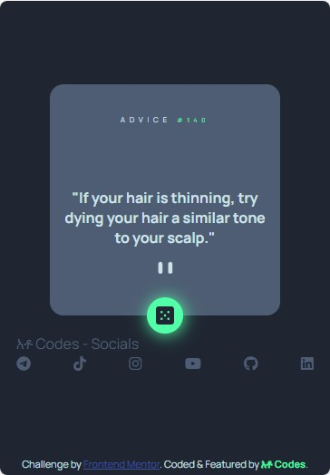
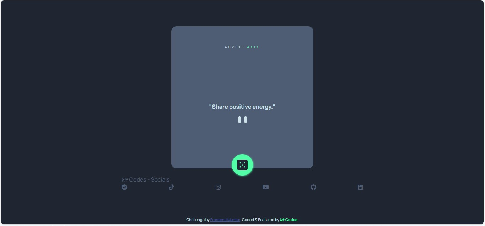

# Frontend Mentor - Advice generator app solution (Featured)

This is a solution to the [Advice generator app challenge on Frontend Mentor](https://www.frontendmentor.io/challenges/advice-generator-app-QdUG-13db).

## Table of contents

- [Overview](#overview)
  - [The challenge](#the-challenge)
  - [Screenshot](#screenshot)
  - [Links](#links)
- [My process](#my-process)
  - [Built with](#built-with)
  - [Continued development](#continued-development)
  - [Useful resources](#useful-resources)
- [Socials](#አቶ-Codes-Social-Media)

## Overview

Its a web app based on advice api to generate random advices built with html, css and js

### The challenge

Users should be able to:

- View the optimal layout for the app depending on their device's screen size
- See hover states for all interactive elements on the page
- Generate a new piece of advice by clicking the dice icon

### Screenshot




### Links

- Solution URL: [Add solution URL here](https://your-solution-url.com)
- Live Site URL: [Add live site URL here](https://your-live-site-url.com)

### Built with

- Semantic HTML5 markup
- CSS custom properties
- Flexbox
- CSS Grid
- Mobile-first workflow

### What I learned

You can attach an async function to events

```js
const renderQuote = async () => {
  const { slip } = await get_advice();
  const { id, advice } = slip;
  ADVICE.textContent = `"${advice}"`;
  QUOTEID.textContent = `#${id}`;
};
BTN.onclick = renderQuote;
```

### Continued development

Hopefully if this project gets more intraction; am planning to build an api for the project

### Useful resources

- [FrontEnd Mentor](https://www.frontendmentor.io?ref=challenge) - Front end challenges to test and sharpen front end skills.

## አቶ Codes Social Media

- Telegram - [@atocodes](https://t.me/atocodes)
- TikTok - [@atocodes](https://www.tiktok.com/@atocodes)
- Instagram - [@atocodes](https://www.instagram.com/ato.codes/)
- YouTube - [@atocodes](https://youtube.com/@atocodes?feature=shared)
- Linked In - [@atocodes](https://www.linkedin.com/in/atocodes/)
